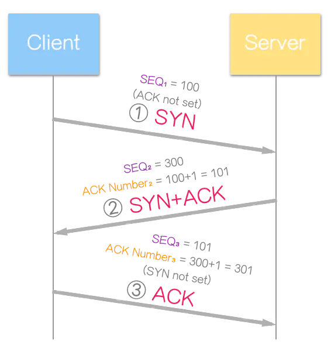
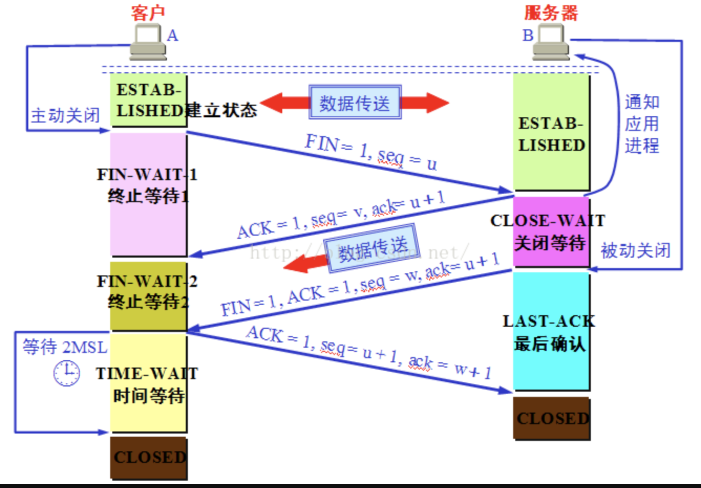
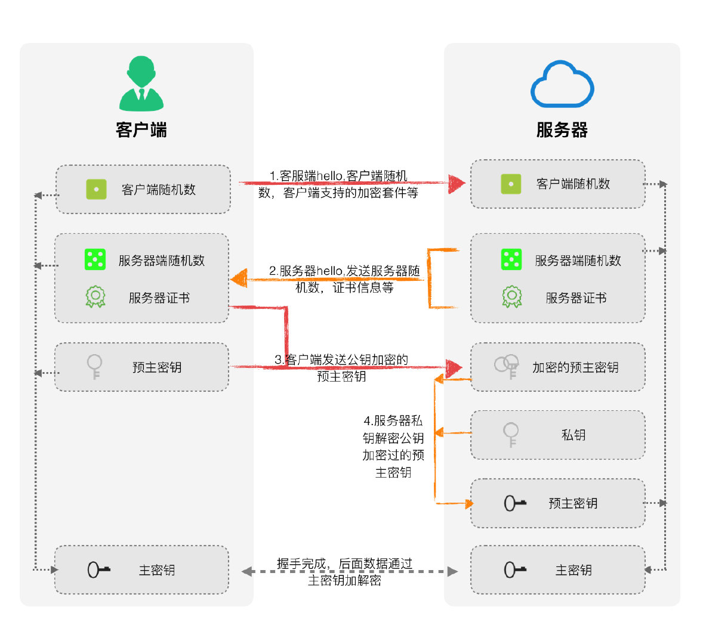
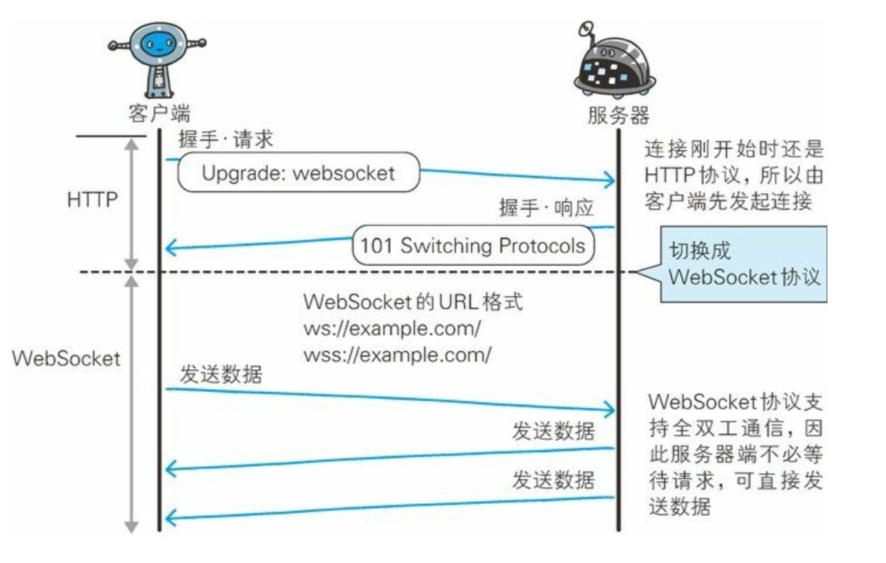

- [HTTP 核心问题](#http-%e6%a0%b8%e5%bf%83%e9%97%ae%e9%a2%98)
  - [HTTP 版本](#http-%e7%89%88%e6%9c%ac)
  - [HTTP-CODE](#http-code)
  - [HTTP header](#http-header)
  - [HTTP method](#http-method)
  - [HTTP 请求/响应报文](#http-%e8%af%b7%e6%b1%82%e5%93%8d%e5%ba%94%e6%8a%a5%e6%96%87)
  - [HTTPS](#https)
  - [TCP](#tcp)
    - [TCP 三次握手](#tcp-%e4%b8%89%e6%ac%a1%e6%8f%a1%e6%89%8b)
    - [TCP 四次挥手](#tcp-%e5%9b%9b%e6%ac%a1%e6%8c%a5%e6%89%8b)
    - [TLS 握手](#tls-%e6%8f%a1%e6%89%8b)
    - [websocket 握手](#websocket-%e6%8f%a1%e6%89%8b)
    - [DNS](#dns)
  - [XMLHttpRequest](#xmlhttprequest)
  - [问题](#%e9%97%ae%e9%a2%98)

# HTTP 核心问题

> 超文本传输协议（HyperText Transfer Protocol），应用层协议，无状态。

## HTTP 版本

1. HTTP 1.0
   - [状态码](#HTTP-CODE)
   - Cache 机制（Expires）
   - 用户代理的字段
2. HTTP 1.1
   - 长链接 connection: keep-alive
   - 管线化 pipeline （复用 tcp 连接）：
     - 若干个请求排队串行化单线程处理，后续请求需等待前次请求返回之后执行，一旦有请求超时，后续请求只能被阻塞，即线头阻塞。
   - 缓存处理
     - 强缓存 cache-control
       - max-age 秒数
       - no-store 禁止缓存
       - no-cache 缓存，立即失效
       - must-revalidate 可配置缓存
     - 协商缓存
       - if-modified-since - last-modified
       - if-none-match - etag
   - 断点续传、host 域支持
   - 存在问题：
     - TCP 慢启动
     - 队头阻塞
     - 无并行响应
3. HTTP2.0
   - 二进制分幀
   - 多路复用
   - 头部压缩 hpack
   - 服务器推送
   - 可设置请求优先级
4. QUIC
   - 在 UDP 的基础上实现类似 TCP 的流量控制、可靠传输
   - 集成 TLS 加密功能-减少握手所需 RTT
   - 快速握手 - 0-RTT / 1-RTT

## HTTP-CODE

1. 1XX 通知：

- 100('Continue')
- **101('Switching protocol')**
  - 请求报头：客户端把 Upgrade 报头设置为一组希望使用的协议。
  - 响应报头：如果服务器同意切换协议，它就返回一个 Upgrade 报头，说明它将切换到那个协议，并附上一个空白行。服务器不用关闭 TCP 链接，而是直接在该 TCP 连接上开始使用新的协议。

2. 2XX 成功

   - **200("OK")**
   - 201("Created") 当服务器依照客户端的请求创建了一个新资源时，发送此响应代码。
   - 202("Accepted")
   - 203("Non-Authoritative Information")
   - **204("No Content")** 无主体数据
     若服务器拒绝对 PUT、POST 或者 DELETE 请求返回任何状态信息或表示，那么通常采用此响应代码。服务器也可以对 GET 请求返回此响应代码，这表明“客户端请求的资源存在，但其表示是空的”。注意与 304("Not Modified")的区别。204 常常用在 Ajax 应用里。服务器通过这个响应代码告诉客户端：客户端的输入已被接受，但客户端不应该改变任何 UI 元素。
   - 205("Reset Content")
   - **206("Partial Content")** 断点续传

3. 3XX 重定向

   - 300("Multiple Choices")
   - **301("Moved Permanently")**
   - **302("Found") / ”Moved Temporarily”**
   - 303("See Other")
   - **304("Not Modified")** 不发送实体主体数据
   - 305("Use Proxy")
   - 307("Temporary Redirect")

4. 4XX 客户端错误

   - **400("Bad Request")** 请求无效，前端提交字段与后端实体不一致
   - **401("Unauthorized")** 未授权
   - 402("Payment Required")
   - **403("Forbidden")** 服务收到请求，但拒绝执行
   - **404("Not Found")**
   - **405("Method Not Allowd")**
   - 406("Not Acceptable")

5. 5XX 服务端错误

   - **500("Internal Server Error")**
   - 501("Not Implemented")
   - **502("Bad Gateway")** 表明代理方面出现问题，或者代理与上行服务器之间出现问题
   - **503("Service Unavailable")**

## HTTP header

1. 数据压缩
   - Accept-Encoding: gzip / defalte / br
   - Content-Encoding
2. 分块传输
   - Transfer-Encoding: chunked（与 Content-Length 互斥）
3. 大文件传输 range
   - Accept-Ranges: bytes
   - Content-Range
   - 多个范围请求：响应报文的数据类型是“multipart/byteranges”，body 里的多个部分会用 boundary 字符串分隔。
4. CORS
   - Origin
   - Access-Control-Allow-Origin

## HTTP method

1. option
2. put 更新 - 幂等
3. head
4. delete
5. get
   - 产生一个 TCP 数据包，header 和 data 一起发送服务器，然后返回数据
   - 安全幂等可缓存
   - 浏览器历史记录、可被缓存、可加书签
   - 大小限制（浏览器和服务器做的限制）
6. post
   - 产生两个数据包，client 先发送 header，服务器响应 100('continue'),client 发送 data，然后服务器响应。
   - 不安全不幂等
   - 无浏览器历史记录、（通常）不可缓存、无法添加书签
   - [post 作缓存](https://www.jianshu.com/p/8ee08d531a7d)
     > 通过对 Post 体的摘要、处理非 idempotent request 请求和区别 idempotent request 和非 idempotent request 请求，可以实现对 Post 的缓存。当然为了进一步提高效率，可以使用缓存握手的方式，在互联网上只发送摘要，在客户端和正向代理以及反向代理和服务端之间的局域网类发送完整的消息体。

## HTTP 请求/响应报文

1. 请求报文
   - 请求行： 请求方法 URL HTTP 版本
   - 请求头部： Accept Content Referer User-Agent 等头部字段
   - 空行
   - 请求体
2. 响应报文
   - 响应行： HTTP 版本 状态码 描述信息
   - 响应头部： Server Date Transfer-Encoding 等字段
   - 响应体

## HTTPS

> HTTPS 是一种通过计算机网络进行安全通信的传输协议，经由 HTTP 进行通信，利用 SSL/TLS 建立全信道，加密数据包。HTTPS 使用的主要目的是提供对网站服务器的身份认证，同时保护交换数据的隐私与完整性。

1. 核心区别

   - 在应用层和传输层之间加入安全层 SSL/TLS
   - 收发报文不再使用 socket api，而是调用专门的安全接口

2. 具体区别

   - HTTP 明文传输、HTTPS 加密传输
   - HTTP 80 端口、HTTPS 443 端口

TLS 由记录协议、握手协议、警告协议、变更密码规范协议、扩展协议等几个子协议组成，综合使用了对称加密、非对称加密、身份认证等许多密码学前沿技术。

1. 加密过程
   浏览器和服务器在使用 TLS 建立连接时需要选择一组恰当的加密算法来实现安全通信，这些算法的组合被称为“密码套件”（cipher suite，也叫加密套件）。
   密钥交换算法 + 签名算法 + 对称加密算法 + 分组模式 + 摘要算法
   **ECDHE-RSA-AES256-GCM-SHA384**
   “握手时使用 ECDHE 算法进行密钥交换，用 RSA 签名和身份认证，握手后的通信使用 AES 对称算法，密钥长度 256 位，分组模式是 GCM，摘要算法 SHA384 用于消息认证和产生随机数。”

## TCP

TCP 🆚 UDP

1.  TCP 是面向连接的可靠性传输，UDP 是不可靠的、发送消息之前不需要建立连接
2.  TCP 面向字节流，UDP 面向报文
3.  TCP 首部较大约 20 字节，UDP 为 8 字节
4.  TCP 只能是 1 对 1，UDP 可 1 对 n

### TCP 三次握手

> 在实际的通信中，
> 序号并不是从 1 开始的，而是需要用随机数计算出一个初始值，这是因为
> 如果序号都从 1 开始，通信过程就会非常容易预测，有人会利用这一点来发动攻击。但是如果初始值是随机的，那么对方就搞不清楚序号到底是从
> 多少开始计算的，因此需要在开始收发数据之前将初始值告知通信对象。


具体过程：

1. Client 发送序列号 SYN（seq=x）到 Server；
2. Server 发送序列号 SYN（seq=y）和确认号 ACK（ack number2 = x + 1）到客户端；
3. Client 发送确认号 ACK（ack number3=y+1）到 Server；

### TCP 四次挥手


具体过程：

1. Client 释放连接信号 FIN（seq=u）到 Server；
2. Server 发送确认号 ACK（seq=v 和 ack=u+1）到 Client；
3. Server 释放连接信号 FIN（seq=w）和确认号 ACK（ack=u+1）到 Client；
4. Client 发送确认号（ack=w+1 和 seq=u+1）到 Server；

### TLS 握手

TLS 握手过程成会完成以下：

- 指定将使用的 TLS 版本（TLS 1.0、1.2、1.3 等）
- 确定将使用哪些加密套件。
- 通过服务器的公钥和 SSL 证书颁发机构的数字签名来验证服务器的身份
- 握手完成后，生成会话密钥以使用对称加密
  
  具体过程：

1. client hello： 包括客户端支持的 TLS 版本、加密套件和客户端随机值。
2. server hello：包括服务器 ssl 证书、加密套件、服务器随机值
3. client 发送公钥加密的预主密钥
4. server 用私钥解密公钥加密的预主密钥
   - client finished 消息（密钥加密）
   - server finished 消息（密钥加密）
5. 握手完成，后续数据经过主密钥加解密。

### websocket 握手

WebSocket 协议实现起来相对简单。它使用 HTTP 协议进行初始握手。成功握手之后，就建立了连接，WebSocket 基本上使用原始 TCP 读取/写入数据。


```
GET /chat http/1.1
Host: www.example.com
Upgrade: websocket // 1
connection: Upgrade // 2 1和2 升级为websocket协议
Sec-WebSocket-Key: x3JJHMbDL1EzLkh9GBhXDw==
Sec-WebSocket-Protocol: chat, superchat
Sec-WebSocket-Version: 13
```

### DNS

DNS（Domain Name System，域名系统），因特网上作为域名和 IP 地址相互映射的一个分布式数据库，能够使用户更方便的访问互联网，而不用去记住能够被机器直接读取的 IP 数串。通过主机名，最终得到该主机名对应的 IP 地址的过程叫做域名解析（或主机名解析）。

DNS 查询的两种方式：
1、递归查询
2、迭代查询

## XMLHttpRequest

FormData 与表单提交的区别：

- FormData 不仅能读取表单数据，也能自行追加数据
- FormData 允许上传多个文件流
- FormData 相同键不会被覆盖，表单提交相同键会被覆盖
- 原始表单提交，contentType 默认为 application/x-www-urlencoded,表单数据为键值对，用&分割。
- FormData，contentType 一般为 multipart/form-data，允许二进制流（boundry 空行隔开），也可提交键值对数据。
- FormData 用 append 添加数据。

```
const xhr = new XMLHttpRequest()
xhr.timeout = '3000' // 设置超时时间
xhr.responseType = 'json' // 返回类型
xhr.open('POST', URL, asyncBool = true) // 默认异步发送
/**
 * 同步请求 asyncBool=false
 * 必须满足：
 * xhr.timeout = 0
 * xhr.withCredentials = false
 * xhr.responseType = ''
 */
// 设置header，必须在open之后，send之前
xhr.setRequestHeader('Content-Type', 'application/json')

// 相应回调函数
xhr.ontimeout = e => { }
xhr.onerror = e = {}
xhr.onloadstart = e = {}
xhr.onloadend = e => { }
xhr.upload.onprogress = e => {
  if(e.lengthComputed) let percent = e.loaded / e.total
 } // 上传
xhr.onprogress = e = {} // 下载

xhr.onreadystatechange = e => {
  // xhr.readyState
}
xhr.onload = e => {
  if(e.status === 200){}
}


xhr.send(data) // 发送数据
```

| xhr.readyState |              状态              | 描述                                                       |
| :------------: | :----------------------------: | ---------------------------------------------------------- |
|       0        |    UNSENT(初始状态，未打开)    | xhr 对象成功构建，open()方法还未调用                       |
|       1        |     OPENED(已打开，未发送)     | open()方法已调用，send()方法未调用                         |
|       2        | HEADERS_RECEIVED(已获取响应头) | send()方法已调用，响应头和响应状态已返回                   |
|       3        |    LOADING(正在下载响应体)     | response entity body 正在下载，xhr.response 可能有响应数据 |
|       4        |     DONE(整个传输过程结束)     | 传输过程结束，不管成功还是失败                             |

## 问题

1. 【问题 1】为什么连接的时候是三次握手，关闭的时候却是四次握手？

答：因为当 Server 端收到 Client 端的 SYN 连接请求报文后，可以直接发送 SYN+ACK 报文。其中 ACK 报文是用来应答的，SYN 报文是用来同步的。但是关闭连接时，当 Server 端收到 FIN 报文时，很可能并不会立即关闭 SOCKET，所以只能先回复一个 ACK 报文，告诉 Client 端，"你发的 FIN 报文我收到了"。只有等到我 Server 端所有的报文都发送完了，我才能发送 FIN 报文，因此不能一起发送。故需要四步握手。

2. 【问题 2】为什么 TIME_WAIT 状态需要经过 2MSL(最大报文段生存时间)才能返回到 CLOSE 状态？

答：虽然按道理，四个报文都发送完毕，我们可以直接进入 CLOSE 状态了，但是我们必须假象网络是不可靠的，有可以最后一个 ACK 丢失。所以 TIME_WAIT 状态就是用来重发可能丢失的 ACK 报文。在 Client 发送出最后的 ACK 回复，但该 ACK 可能丢失。Server 如果没有收到 ACK，将不断重复发送 FIN 片段。所以 Client 不能立即关闭，它必须确认 Server 接收到了该 ACK。Client 会在发送出 ACK 之后进入到 TIME_WAIT 状态。Client 会设置一个计时器，等待 2MSL 的时间。如果在该时间内再次收到 FIN，那么 Client 会重发 ACK 并再次等待 2MSL。所谓的 2MSL 是两倍的 MSL(Maximum Segment Lifetime)。MSL 指一个片段在网络中最大的存活时间，2MSL 就是一个发送和一个回复所需的最大时间。如果直到 2MSL，Client 都没有再次收到 FIN，那么 Client 推断 ACK 已经被成功接收，则结束 TCP 连接。

3. 【问题 3】为什么不能用两次握手进行连接？

答：3 次握手完成两个重要的功能，既要双方做好发送数据的准备工作(双方都知道彼此已准备好)，也要允许双方就初始序列号进行协商，这个序列号在握手过程中被发送和确认。

现在把三次握手改成仅需要两次握手，死锁是可能发生的。作为例子，考虑计算机 S 和 C 之间的通信，假定 C 给 S 发送一个连接请求分组，S 收到了这个分组，并发 送了确认应答分组。按照两次握手的协定，S 认为连接已经成功地建立了，可以开始发送数据分组。可是，C 在 S 的应答分组在传输中被丢失的情况下，将不知道 S 是否已准备好，不知道 S 建立什么样的序列号，C 甚至怀疑 S 是否收到自己的连接请求分组。在这种情况下，C 认为连接还未建立成功，将忽略 S 发来的任何数据分 组，只等待连接确认应答分组。而 S 在发出的分组超时后，重复发送同样的分组。这样就形成了死锁。

4. 【问题 4】如果已经建立了连接，但是客户端突然出现故障了怎么办？

TCP 还设有一个保活计时器，显然，客户端如果出现故障，服务器不能一直等下去，白白浪费资源。服务器每收到一次客户端的请求后都会重新复位这个计时器，时间通常是设置为 2 小时，若两小时还没有收到客户端的任何数据，服务器就会发送一个探测报文段，以后每隔 75 秒钟发送一次。若一连发送 10 个探测报文仍然没反应，服务器就认为客户端出了故障，接着就关闭连接。

5. cookie 放哪里？cookie 能做的事情和存在的价值
   **Cookie**

   - cookie 是存在浏览器上的一小段数据，有保质期
   - 可 js 设置，也可服务器下发 set-cookie 操作
   - 大小限制，一般容量 4k 左右
   - 安全性，document.cookie 可查看当前网站的 cookie（无 HttpOnly）
   - 满足同源策略
   - SameSite
     - None - 无论是否跨站都会携带 cookie （只能在 HTTPS 环境下，secure 下运行）
     - Strict - 只允许同站发送 cookie
       - 同站：只要两个 URL 的 eTLD+1 相同即可，不需要考虑协议和端口，eTLD 表示有效顶级域名
     - Lax
       - chrome 80 默认 Lax，允许部分第三方携带 cookie
       - POST 表单、AJAX、iframe、image 不发送 cookie
       - script 方式 jsonp 不发送 cookie
       - **解决方案：设置 SameSite=None**
         - HTTP 接口不支持 SameSite=None，所以加上 Secure
         - UA 检测（IOS12 safari 和老版本 Chrome 把 SameSite=None 识别成 Strict）不下发 SameSite=None

   Cookie 价值

   - 会话状态管理（登陆状态、购物车、需要记录的值等）
   - 个性化设置（用户自定义设置、主题）
   - 精准广告、推送

   session

   - session 状态存储于服务端、以 seesionId 的形式下发浏览器 cookie

   token（令牌）

   - 用于验证和信息交换
   - 无状态
   - 防 csrf
   - 多站点使用
   - 支持移动平台、性能好

6. cookie 和 token 都放在 header，为何只劫持 cookie？
   因为传统的 cookie 保存的有 sessionid，服务器会根据这个 sessionid，确保服务器和客户端的对话；这时 cookie 是有状态的，意味着验证记录或者会话需要一直在服务端和客户端之间保持。而 token 是无状态的，服务器不记录哪些登陆了或者下发了哪些 token，只会验证 token 是否有效。通常 token 也有有效时间，来确保不被劫持。所以劫持 cookie 比劫持 token 更有效果。

7. 预防 CSRF？
   CSRF 跨站请求伪造：在用户不知情的情况下以受信网站的身份访问有 csrf 缺陷的网站。

   1. http header 验证 referer 字段或者自定义属性验证
   2. 表单添加随机值 token

8. XSS
   跨站脚本攻击

   1. cookie 设置 http-only（防止 js 获取 cookie）和 secure（只能 https 携带）
   2. 对用户输入转译
   3. 开启 CSP（content-security-policy）

9. 输入 URL 的过程

   1. 输入 URL，查找缓存
   2. DNS 查询
   3. 建立 TCP 连接
   4. Client 发送 http 请求
   5. Server 处理请求
   6. Server 响应请求
   7. 浏览器解析、render page

10. 一个图片 url 访问后直接下载怎样实现？
    修改响应头的 oss 属性

    ```
    x-oss-object-type: Normal
    x-oss-request-id: 598D5ED34F29D01FE2925F41
    x-oss-storage-class: Standard
    ```

11. fetch 条 post 请求的时候，总是发送两次请求，第一次返回 204
    fetch 第一次发送了 options 请求，询问服务器是否支持请求头，如果支持第二次发送请求。
