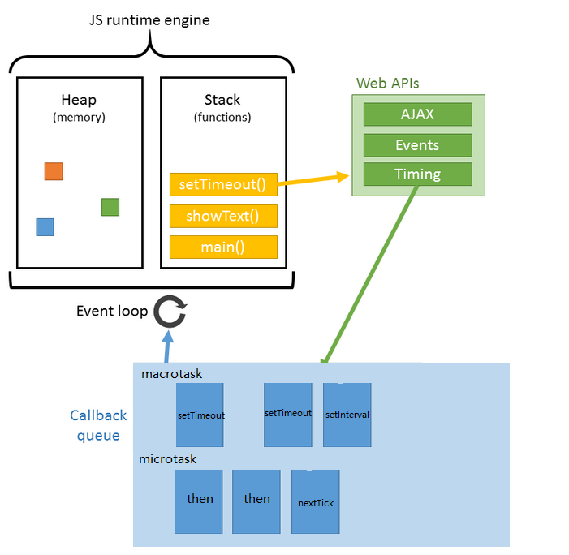

## JavaScript

### EventLoop

> EventLoop 是一个程序结构，用于等待和发送消息和事件。
> 程序中设置两个线程，一个负责程序本身的运行，叫做主线程；另一个负责主线程与其他线程（主要是 IO 操作）的通信，称为 EventLoop 线程（消息线程）。
> 主线程开始运行，每当遇到 IO 操作，主线程就让 EventLoop 线程通知相应的 IO 程序，主线程接着往后运行，当 IO 完成之后，EventLoop 线程再把结果返回主线程。主线程调用事先设定的回调函数，完成任务。


#### 任务队列

1. 所有同步任务都在主线程上运行，形成一个执行栈（execution context stack）
2. 主线程之外还存在一个任务队列（task queue），只要异步任务有了结果，就在任务队列放置一个事件
3. 一旦执行栈中所有的同步任务执行完毕，系统就会读取任务队列，进入执行栈。
4. 主线程不断重复第三步。

#### Event Loop

主线程在运行的时候，会产生堆（heap）和栈（stack），栈中的代码调用各种外部 API，它们在任务队列中加入各种事件（click，load，done）。只要栈中的代码执行（同步任务）完毕，主线程就会去读取任务队列（异步任务），依次执行那些事件对应的回调函数。



##### 宏任务 macrotask

setTimeout， setInterval， setImmediate， I/O， callabck， UI 渲染， MessageChannel

优先级：
主代码块 > setImmediate > postMessage > setTimeout/Interval

##### 微任务 microtask

process.nextTick，Promise， MutationObserver， Async

优先级：
process.nextTick > Promise > MutationObserver

##### 执行顺序

crotask-order.png>)

1. 执行 macrotask 队列的一个任务
2. 执行当前 microtask 队列的所有任务
3. UI render
4. 浏览器只保证 requestAnimationFrame 在重绘之前执行，没有确定的时间，何时重绘由浏览器决定。

示例 1:


示例 2:


### 垃圾回收 GC

- 标记清除法
  - 将不再使用的对象标记为“无法到达的对象”，即从根部（全局对象）开始定时扫描内存中的对象，凡事能从根部到达的对象，保留。那些从根部出发无法触及的对象被标记为不可使用，稍后进行回收。
  - 垃圾收集器在运行的时候给存储在内存中的所有变量添加标记，然后他会去掉环境中的变量和被环境中的变量引用的变量的标记，而在此之后再被添加标记的变量被视为准备删除的变量，原因是环境中的变量已经无法访问这些变量了。最后垃圾收集器完成内存清除工作，销毁那些带标记的值并回收它们所占用的内存空间。
- 引用计数法
  垃圾收集器跟踪收集每个值被引用的次数。当声明一个变量并将一个引用类型的值赋给该变量时，则这个值的引用次数为 1，如果同一个值又被赋给另一个变量，则值的引用次数加 1。相反，如果包含这个值的变量又取得另一个值，则这个值的引用次数减 1。当这个值的引用次数为 0，就表示没有办法再访问这个值，就可以将其内存空间回收起来，当垃圾回收器下一次运行的时候，就会回收那些引用次数为 0 的值所占用的内存空间。

### 内存泄漏

1. 意外的全局变量
   - 使用`use strict`严格模式
2. 被遗忘的计时器或回调函数
   - `clearTimeout`/`clearInterval`/`removeEventListener`
3. 脱离 DOM 元素的引用
   - `WeakMap`/`WeakSet` 弱引用
4. 闭包

### 调用堆栈

**执行上下文**

- **全局执行上下文** - 全局对象（this 指向这个对象）
- **函数执行上下文** - 函数被调用的时候创建
- EVAL 函数执行上下文 - eval 环境中

**执行栈：** 用于存储在代码执行期间创建的所有上下文，LIFO（后进先出）


#### 执行上下文创建

1. **确定 this 的值，thisBinding**
   - 全局执行上下文，this 指向全局对象，浏览器->window，nodejs -> 文件 module 对象
   - 函数执行上下文，this 的值取决于函数的调用方式（默认、隐式、显示、硬、new 绑定、箭头函数）
2. **词法环境（Lexical Environment）**创建 - 存储**函数声明和 let、const 绑定**
   - 环境记录（EnvironmentRecord）：存储函数和变量声明实际位置
     - 全局环境 - 全局变量和全局对象
     - 函数环境 - 包括 arguments 对象
   - 对外部环境的引用（outer）：可以访问其外部词法环境
     - 全局 - null
     - 函数 - 全局或引用环境
3. **变量环境（Variable Environment）** 创建 - 仅存储 **var** 变量绑定

```
GlobalExectionContext = {

  ThisBinding: <Global Object>,

  LexicalEnvironment: {
    EnvironmentRecord: {
      Type: "Object",
      // 标识符绑定在这里
      a: < uninitialized >,
      b: < uninitialized >,
      multiply: < func >
    }
    outer: <null>
  },

  VariableEnvironment: {
    EnvironmentRecord: {
      Type: "Object",
      // 标识符绑定在这里
      c: undefined,
    }
    outer: <null>
  }
}

FunctionExectionContext = {

  ThisBinding: <Global Object>,

  LexicalEnvironment: {
    EnvironmentRecord: {
      Type: "Declarative",
      // 标识符绑定在这里
      Arguments: {0: 20, 1: 30, length: 2},
    },
    outer: <GlobalLexicalEnvironment>
  },

  VariableEnvironment: {
    EnvironmentRecord: {
      Type: "Declarative",
      // 标识符绑定在这里
      g: undefined
    },
    outer: <GlobalLexicalEnvironment>
  }
}
```

### 作用域与闭包

#### 闭包

> 闭包是指有权访问另一个函数作用域中的变量的函数

#### 作用域链

> 每个函数都有执行上下文环境，当代码在这个环境中执行时，会创建变量对象的作用域链，作用域链是一个对象列表或对象链，它保证了变量对象的有序访问。

### this

#### this 绑定规则

1. 默认绑定
   - `use strict`严格模式下 this 绑定 undefined
   - 非严格模式下 this 绑定到 window 全局对象
2. 隐式绑定
   - 当函数引用又上下文对象时，隐式绑定规则会把函数中的 this 绑定到上下文对象。
   - 隐式绑定容易丢失
3. 显示绑定
   - call
   - apply
   - bind
4. new 绑定
   1. 在内存中创建一个新的对象
   2. 这个新对象内部的`[[Prototype]]`指向函数的 prototype 属性
   3. 函数的 this 绑定到这个新创建的对象上
   4. 函数体内代码执行（添加属性和方法到这个新创建的对象上）
   5. 返回这个对象或者是函数的返回值
5. 箭头函数
   - 根据外层（函数或全局）作用域（词法作用域）决定

#### call apply bind new

1. call

   ```
   Function.prototype.myCall = function(context) {
     context = context ? Object(context) : window
     context.fn = this

     let args = [...arguments].slice(1)
     let result = context.fn(...args)

     delete context.fn
     return result
   }
   ```

2. apply

   ```
   Function.prototype.myApply = function(context, arr) {
     context = context ? Object(context) : window
     context.fn = this

     let result
     if(!arr) { result = context.fn() }
     else { result = context.fn(...arr)}

     delete context.fn
     return result
   }
   ```

3. bind
   ```
   Function.prototype.myBind = function(context) {
     const self = this
     const args = Array.prototype.slice.call(arguments, 1)
     if(typeof self !== 'function') {
       throw new TypeError('bind should be function')
     }
     return function () {
       const bindArgs = Array.prototype.slice.call(arguments)
       return self.apply(context, args.concat(bindArgs))
     }
   }
   ```
4. new
   ```
   function myNew() {
     // 获取构造函数，同时删除arguments第一个参数
     const Con = [].shift.call(arguments)
     // 创建一个空的对象并连接到原型，obj可以访问构造函数原型中的属性
     // Object.setPrototypeOf(obj, Con.prototype)
     // obj.__proto__ = Con.prototype
     const obj = Object.create(Con.prototype)
     // 绑定this实现继承，obj可以访问到构造函数中的属性
     const ret = Con.apply(obj, arguments)
     // 优先返回构造函数返回的对象
     return ret instanceof Object ? ret : obj
   }
   ```
   ```
   function _new(fn, ...args) {
     // 创建一个新对象
     const obj = Object.create(fn.prototype)
     // this指向新创建的对象
     // 新创建的对象__proto__指向构造函数的原型
     // obj.__proto__ = fn.prototype
     const ret = fn.apply(obj, args)
     return ret instanceof Object ? ret : obj
   }
   ```
5. curry

   ```
   function curryAdd(a) {
     function sum(b) {
       a = a + b
       return sum
     }
     sum.toString = function() {
       return a
     }
     return sum
   }
   // curryAdd(1)(2)(3)(4) // 10
   ```

   ```
    const curry = (fn) =>
      (judge = (...args) =>
        args.length >= fn.length ? fn(...args) : (...arg) => fn(...args, ...arg));

    const test = curry(function (a, b, c) {
      console.log(a + b + c);
    });

    test(1, 2, 3);
    test(1, 2)(3);
   ```

### 节流防抖

1. 节流

   > 某个函数在一定时间间隔内只执行一次，在这个时间间隔内无视后来产生的函数调用请求，也不会延长时间间隔。

   ```
   function throttle(fn, wait = 50) {
     let previous = 0
     return function(...args) {
       let now = +new Date()
       if(now - previous > 50) {
         previous = now
         fn.apply(this, args)
       }
     }
   }
    const betterFn = throttle(() => console.log('fn excuted'), 1000)
    // 时间间隔大于1000ms才会执行
    setInterval(betterFn, 10)
    // 每隔10ms调用betterFn

   ```

2. 防抖

   > debounce 是指某个函数在某段时间内，无论触发多少次回调，都只执行最后一次。debounce 强调函数自上次被调用之后经过一定时间才会再次调用。

   ```
   function debounce(fn, wait = 50, immediate) {
     let timer = null
     return function(...args) {
       if(timer) clearTimeout(timer)

       if(immediate && !timer) {
         // 首次执行
         fn.apply(this, args)
       }
       timer = setTimeout(() => {
         fn.apply(this, args)
       }, wait)
     }
   }
   const betterFn = debounce(() => console.log('fn excuted'), 1000, true)
   // 第一次触发scroll执行一次，后续只有在停止滚动1秒后才执行函数
   window.addEventListener('scroll', betterFn)
   ```

3. 加强版节流
   > wait 时间内，函数触发就重新设置定时器，wait 时间到了就立即执行。
   ```
   function throttlePlus(fn, wait = 50) {
     let previous = 0
     let timer = null
     return function(...args) {
       let now = +new Date()
       if(now - previous < wait) {
         if(timer) clearTimeout(timer)
         timer = setTimeout(() => {
           previous = now
           fn.apply(this, args)
         }, wait)
       }
       else {
         previous = now
         fn.apply(this, args)
       }
     }
   }
   ```

#### 深浅拷贝

##### 浅拷贝

> 创建一个新对象，这个新对象有着原始对象属性值的一份精确拷贝。如果属性是基本类型值，拷贝的就是基本类型的值。如果是引用类型，拷贝的就是内存地址。

1. `Object.assign`

   - `Object.assign`用于将所有可枚举属性从一个或多个源对象复制到目标对象，并且返回这个目标对象。
   - `const target = Object.assign({}, obj1, obj2)`
     ```
     Object.defineProperty(Object, 'myAssign', {
       value: function(target) {
         'use strict'
         if(target == null) {
           throw new Error('Cannot convert undefined or null to object')
         }
         const to = Object(target)
         for (let index=1,ilen=arguments.length;i<ilen;i++) {
           let nextSource = arguments[index]
           if(nextSource != null) {
             for(let nextKey in nextSource) {
               if(nextSource.hasOwnProperty.call(nextSource, nextKey)) {
                 to[nextKey] = nextSource[nextKey]
               }
             }
           }
         }
         return to
       },
       writable: true,
       configurable: true
     })
     ```

2. spread 扩展符
   - `[...[arr]]` `{...{obj}}`
3. `Array.prototype.slice`
4. `concat`

##### 深拷贝

> 深拷贝会拷贝所有的属性，并拷贝属性指向的动态分配的内存，当对象和它所引用的对象一起被拷贝时就是深拷贝。

1. `JSON.parse(JSON.stringify(obj))`
   - 会忽略 `undefined` `symbol`
   - 不能序列化函数
   - 不能解决循环引用的对象
   - 不能处理正则和`new Date`

```
function isObject(obj) {
  return typeof obj === 'object' && obj != null
}
```

```
function cloneDeep(source, hash = new WeakMap()) {
  if (!isObject(source)) return source
  if(hash.has(source)) return hash.get(source)

  let target = Array.isArray(source) ? [] : {}
  hash.set(source, target)

  Reflect.ownKeys(source).forEach(key => {
    if(isObject(key)) {
      target[key]=cloneDeep(source[key], hash)
    } else {
      target[key]=source[key]
    }
  })
  return target
}
```

### 原型


```
function Person(){} // contsruct
const p = new Person() // instance

const child = Object.create(p)
// child.__proto__ === p

Person.prototype.contructor === Person
// 构造函数原型的constructor指向构造函数

p.__proto__ === Person.prototype
// 实例的__proto__指向构造函数的原型

p.constructor === Person
// 实例的constructor指向构造函数,但实例上并没有构造函数
```

#### 原型链

> 对象拥有一个原型（`prototype`）对象，通过`__proto__`(`[[Prototype]]`)指针指向这个原型对象，并从中继承属性和方法，同时这个原型对象也可能 🈶️ 它的原型对象，这样一层一层，最终指向 null，这就是原型链。


```
p.__proto__ === Person.prototype
p.__proto__.__proto__ === Object.prototype
p.__proto__.__proto__.__proto__ === null
```


```
// Object instanceof Function 	即
Object.__proto__ === Function.prototype // true

// Function instanceof Object 	即
Function.__proto__.__proto__ === Object.prototype // true

// Object instanceof Object 		即
Object.__proto__.__proto__ === Object.prototype	// true

// Function instanceof Function 即
Function.__proto__ === Function.prototype	// true
```

- 原型链的构建依赖于`__proto__`,一层一层连接到 null。
- `instanceof`的原理是一层一层查找`__proto__`，如果和`constructor.prototype`相等则返回 true。

### 继承

1. 原型链继承
   重写子类原型为父类实例，从而继承父类原型属性和方法
   `SubType.prototype = new SuperType()；`
   `SubType.prototype.constructor = SubType;`
   
   缺陷： 多个实例对引用类型的操作会被篡改。
2. 借用构造函数继承
   借用父类的构造函数增强子类实例，等同于复制父类的实例给子类
   ```
   function SubType(){
     SuperType.call(this)
   }
   ```
   缺陷：
   - 只能继承父类的实例属性和方法，不能继承父类原型属性和方法
   - 无法复用，每个子类都有父类实例函数的 f 副本，影响性能
3. 组合继承
   ```
   function SubType(name, age){
     SuperType.call(this)
   }
   SubType.prototype = new SuperType()
   SubType.prototype.constructor = SubType
   ```
   缺陷：
   - 调用两次 SuperType 父类，影响性能
   - 子类创建实例对象时，原型中存在两份相同的属性和方法
4. 原型式继承
   利用一个空对象作为中介，将某个对象直接复制给空对象构造函数的原型
   ```
   function object(obj) {
     function F() {}
     F.prototype = obj
     return new F()
   }
   ```
   `const obj2 = Object.create(obj)`
   缺陷：
   - 继承的多个实例的引用类型属性指向相同，可被篡改
   - 无法传递参数
5. 寄生式继承
   在原型式继承的基础上，增强对象，返回构造函数
   ```
   function objectPlus(original) {
     const clone = object(original)
     clone.someFunc = function() {}
     return clone
   }
   ```
   缺陷（同原型式继承）
6. 寄生组合式继承
   借用构造函数和寄生式继承
   ```
   function inherit(subType, superType) {
     const prototype = Object.create(superType)
     prototype.constructor = subType
     subType.prototype = prototype
   }
   ...
   function SubType(name, age) {
     SuperType.call(this)
   }
   inherit(SubType, SuperType)
   ```
7. class extends
   `super()`调用了父类的构造函数。
   本质上先创建父类的实例对象 this，然后在用子类的构造函数修改 this。并不是说在调用 super 之前子类没有 this，而是 ES6 规定在调用 super 之前在子类构造函数中不能使用 this。

### 模块化

> 模块化主要用来抽离公共代码，隔离作用域，避免变量冲突等。

1. IIFE 自执行函数 - 在一个单独的函数作用域中执行代码，避免变量冲突
2. AMD - 依赖必须提前声明好
   - 实现 - 浏览器端 require.js
   - 说明
     - **依赖前置** - 依赖必须提前声明好
     - **模块异步加载**，指定回调函数
   - 机制
     - 通过 require 加载时，它会先加载对应的依赖，等依赖资源加载完成之后，会执行回调函数，将依赖作为入参，执行对应的业务逻辑。
   - 语法
     - `define(module, [dep1, dep2], callback)`
3. CMD - 支持动态引入依赖文件
   - 实现 - 浏览器端 sea.js
   - 说明：
     - **延迟加载** - 模块使用时再声明
     - 模块使用时才会异步加载执行
4. CommonJS
   1. 文件即模块，每个文件通过 module 来表示，用 require 来引用其他模块，用 module.exports 来导出自身。
   2. 通过 require 来引用文件时，会将文件执行一遍，将其执行结果通过浅拷贝的方式，写入全局内存，后续再引用，直接从内存读取，不需要再次执行对应的文件。
   3. 实现 - node / webpack
   4. 说明：
      - 模块加载同步，即资源加载完成之后再执行。
      - 每个文件都可以是个模块
      - 服务端 - 模块加载是运行时同步加载
      - 浏览器端 - 模块加载是提前编译打包处理
5. UMD - 上述兼容方案
6. ES6 Moudle - 编译时加载
   - 机制： ES6 的模块机制在依赖模块时并不会先去预加载整个脚本，而是生成一个只读引用，并且静态解析依赖，等到执行代码时，再去依赖里取出实际需要的模块。
   - 优势
     - 死代码检测和排除 - treeshaking
     - 模块变量类型检查 - 静态模块结构有助于确保模块之间传递的值或接口类型是正确的
     - 编译器优化 - 可直接导入变量，减少引用层级，程序效率更高
7. CommonJS 🆚 ES6 module
   1. commonjs 模块引用后是一个值的拷贝，
   2. ES module 模块引用后是一个值的动态映射，并且这个映射是只读的。
   3. commonjs 运行时加载
   4. Es module 是编译阶段引用

### 问题：

1. null 和 undefined 区别

   - 给一个全局变量赋值为 null，相当于将这个变量的指针对象及值清空。如果给对象的属性或者局部变量赋值 null，相当于给属性分配了一块空的内存，然后值为 null。js 会回收全局变量为 null 的对象。
   - 给一个全局变量赋值 undefined，相当于给这个对象的值清空，但是对象仍旧存在。如果给对象的属性赋值 undefined，说明这个值为空值。
   - 声明一个变量，未初始化赋值，就是 undefined。
   - undefined 是全局对象的一个属性
   - null 特指对象的值未设定，是一个字面量，表示缺少的标识，指示变量未指向任何对象。
   - null 是一个表示“无”的对象，转换数字为 0，
   - undefined 是一个表示“无”的原始值，转换数字为 NaN

2. Object 对象属性方法

   ```
   /**
    * hasOwnProperty --- instance(的可枚举属性)
    * for ... in     --- both instance & prototype(的可枚举属性)
    * Object.keys    --- instance(的可枚举属性,不含symbol类型)
    * Object.getOwnPropertyNames  --- instance(的所有非Symbol属性，但包括不可枚举属性)
    * Object.getOwnPropertySymbols  --- instance(的所有Symbol属性)
    * Reflect.ownKeys  --- instance(的所有属性)
    */
   ```

3. Set Map WeakSet WeakMap

- Set
  - 成员唯一、无序且不重复
  - [value, value]，键值与键名是一致的（或者说只有键值，没有键名）
  - 可以遍历，方法有：add、delete、has、clear
- WeakSet
  - 成员都是对象
  - 成员都是弱引用，可以被垃圾回收机制回收，可以用来保存 DOM 节点，不容易造成内存泄漏
  - 不能遍历，方法有 add、delete、has
- Map
  - 本质上是键值对的集合，类似集合
  - 可以遍历，方法很多可以跟各种数据格式转换
- WeakMap
  - 只接受对象作为键名（null 除外），不接受其他类型的值作为键名
  - 键名是弱引用，键值可以是任意的，键名所指向的对象可以被垃圾回收，此时键名是无效的
  - 不能遍历，方法有 get、set、has、delete

4. ES5 继承与 ES6 class 继承区别

   1. class 声明内部完全采用严格模式
   2. class 的所有方法（包括静态和实例方法）都是不可枚举的
   3. class 的所有方法（包括静态和实例方法）都没有原型对象 prototype，也没有`[[construct]]`，不能使用 new 调用
   4. 必须使用 new 调用 class
   5. class 内部无法重写类名
   6. this 生成时机不同，ES5 先 生成子类实例，再调用父类的构造函数修饰子类实例；ES6 的继承是 先生成父类的实例，再调用子类的构造函数修饰父类实例，所以 ES6 可以继承内置对象。

5. `Object.prototype.toString.call`,`instanceof`,`Array.isArray`

   - `Object.prototype.toString.call(type)` 精确判断 type 类型
     - `Object.prototype.toString.call(1)` // [object Number]
     - `Object.prototype.toString.call(null)` // [object Null]
     - `Object.prototype.toString.call(undefined)` // [object Undefined]
     - `Object.prototype.toString.call({})` // [object Object]
   - `instanceof`的内部机制是判断对象的原型链上是否能找到类型的 prototype
     - `[] instanceof Array` // true
     - `[] instanceof Object` //true
     - `'a' instanceof String` // false 不能检测原始类型值
   - `Array.isArray` 用于判断对象是否为数组，可检测 iframes
   - `typeof` 只能检测基本数据类型或者只是 object（null、Array、Function、Object）。

6. 箭头函数 🆚 普通函数

   - 箭头函数没有 this 值，它会从自己作用域链的上一层继承 this
   - 箭头函数没有 call/apply/bind 绑定 this 值
   - 箭头函数没有 arguments、super、new.target、prototype
   - 箭头函数无法使用 new 实例化对象

7. for 🆚 forEach

   - for 循环没有额外的函数调用栈和上下文
   - forEach 实际上是`array.forEach(function(currentValue, index, arr), thisValue),有诸多参数和上下文需要考虑进来
   - forEach 里面操作了 toObject，以及判断终止循环条件比 for loop 复杂一些。

8. 如何处理中文输入

   - compositionstart - 文本框会填入“虚拟文本”（待确认文本），同时触发 input 事件
   - compositionupdate
   - compositionend - 输入好的中文填入 input 中（已确认文本）
   - 上述事件更新一个 bool 值

9. 模拟 promise.finally

   ```
   Promise.prototype.finally = function(callback) {
     const p = this.constructor
     return this.then(
       value => p.resolve(callback()).then(() => value),
       reason => p.resolve(callback()).then(() => throw reason)
     )
   }
   ```

10. 模拟 promise.race

    ```
    Promise.prototype._race = promises => new Promise((resolve, reject) => {
      promises.forEach(item => {
        Promise.resolve(item).then(resolve, reject)
      })
    })
    ```

11. 链式调用
    ```
    class LazyManClass {
      constructor(name) {
        this.name = name
        console.log(`My name is ${name}`)
        this.queue = []
        setTimeout(() => this.next(), 0)
      }
      eat(food) {
        const fn = () => {
          console.log(`I am eating ${food}`)
          this.next()
        }
        this.queue.push(fn)
        return this
      }
      sleepFirst(time) {
        const fn = () => {
          setTimeout(() => {
            console.log(`Wait first for ${time}ms`)
            this.next()
          }, time)
        }
        this.queue.unshift(fn)
        retur this
      }
      sleep(time) {
        const fn = () => {
          setTimeout(() => {
            console.log(`wait for ${time}ms`)
            this.next()
          }, time)
        }
        this.queue.push(fn)
        return this
      }
      next() {
        const fn = this.queue.shift()
        fn && fn()
      }
    }
    function lazyMan(name) {
      return new LazyManClass(name)
    }
    lazyMan('Tom').eat('eggs').sleepFirst(1000).eat('apple').sleep(2000).eat('junk food')
    ```
12. setTimeout 实现 setInterval
    ```
    function mySetInterval() {
      mySetInterval.timer = setTimeout(() => {
        arguments[0]()
        mySetInterval(...arguments)
      }, arguments[1])
      mySetInterval.clear = function () {
        clearTimeout(mySetInterval.timer)
      }
    }
    ```
13. 实现 multiRequest
    ```
    function multiRequest(urls, maxNum, callback) {
      let urlCount = urls.length;
      let requestQueue = [];
      let result = [];
      let currentIndex = 0;
      const handleRequest = (url) => {
        const req = fetch(url).then(res => {
          const len = result.push(res)
          if (len < urlCount && currentIndex + 1 < urlCount) {
            requestQueue.shift()
            handleRequest(urls[++i])
          } else if (len === urlCount) {
            typeof callback === 'function' && callback(result)
          }
        }).catch(e => result.push(e))
        if (requestQueue.push(req) < maxNum) {
          handleRequest(urls[++i])
        }
      };
      handleRequest(urls[i])
    }
    ```
