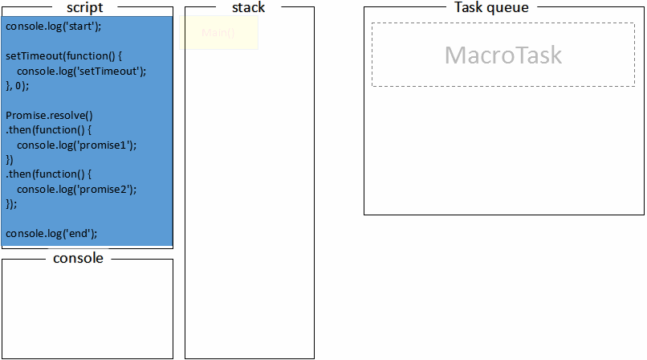

## JavaScript

### EventLoop

> EventLoop 是一个程序结构，用于等待和发送消息和事件。
> 程序中设置两个线程，一个负责程序本身的运行，叫做主线程；另一个负责主线程与其他线程（主要是 IO 操作）的通信，称为 EventLoop 线程（消息线程）。
> 主线程开始运行，每当遇到 IO 操作，主线程就让 EventLoop 线程通知相应的 IO 程序，主线程接着往后运行，当 IO 完成之后，EventLoop 线程再把结果返回主线程。主线程调用事先设定的回调函数，完成任务。

#### 任务队列

1. 所有同步任务都在主线程上运行，形成一个执行栈（execution context stack）
2. 主线程之外还存在一个任务队列（task queue），只要异步任务有了结果，就在任务队列放置一个事件
3. 一旦执行栈中所有的同步任务执行完毕，系统就会读取任务队列，进入执行栈。
4. 主线程不断重复第三步。

#### Event Loop

主线程在运行的时候，会产生堆（heap）和栈（stack），栈中的代码调用各种外部 API，它们在任务队列中加入各种事件（click，load，done）。只要栈中的代码执行（同步任务）完毕，主线程就会去读取任务队列（异步任务），依次执行那些事件对应的回调函数。

##### 宏任务 macrotask

setTimeout， setInterval， setImmediate， I/O， callabck， UI 渲染， MessageChannel

优先级：
主代码块 > setImmediate > postMessage > setTimeout/Interval

##### 微任务 microtask

process.nextTick，Promise， MutationObserver， Async

优先级：
process.nextTick > Promise > MutationObserver

##### 执行顺序

crotask-order.png>)

1. 执行 macrotask 队列的一个任务
2. 执行当前 microtask 队列的所有任务
3. UI render
4. 浏览器只保证 requestAnimationFrame 在重绘之前执行，没有确定的时间，何时重绘由浏览器决定。

示例 1:

示例 2:

### 垃圾回收 GC

- 标记清除法
  垃圾收集器在运行的时候给存储在内存中的所有变量添加标记，然后他会去掉环境中的变量和被环境中的变量引用的变量的标记，而在此之后再被添加标记的变量被视为准备删除的变量，原因是环境中的变量已经无法访问这些变量了。最后垃圾收集器完成内存清除工作，销毁那些带标记的值并回收它们所占用的内存空间。
- 引用计数法
  垃圾收集器跟踪收集每个值被引用的次数。当声明一个变量并将一个引用类型的值赋给该变量时，则这个值的引用次数为 1，如果同一个值又被赋给另一个变量，则值的引用次数加 1。相反，如果包含这个值的变量又取得另一个值，则这个值的引用次数减 1。当这个值的引用次数为 0，就表示没有办法再访问这个值，就可以将其内存空间回收起来，当垃圾回收器下一次运行的时候，就会回收那些引用次数为 0 的值所占用的内存空间。
