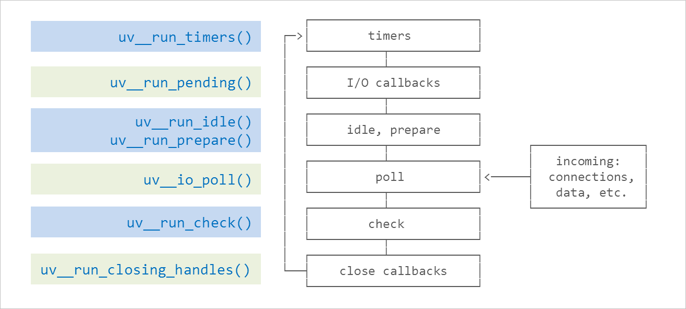
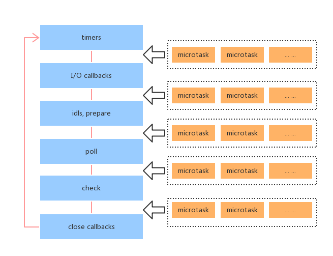
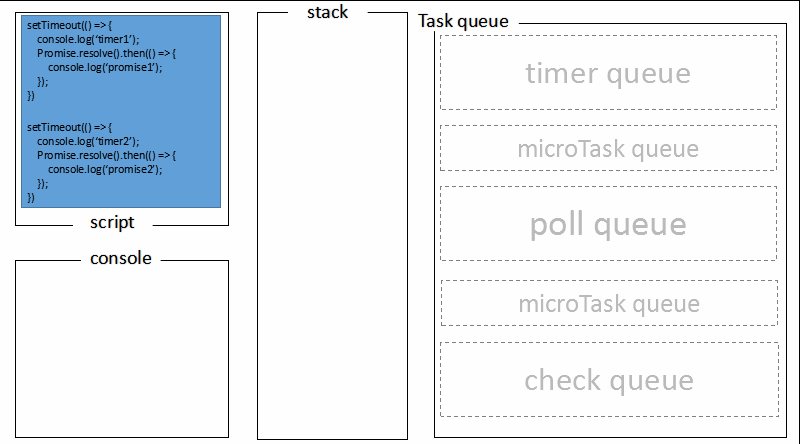

- [NodeJS](#nodejs)
- [V8 内存管理模型](#v8-%e5%86%85%e5%ad%98%e7%ae%a1%e7%90%86%e6%a8%a1%e5%9e%8b)
  - [事件循环](#%e4%ba%8b%e4%bb%b6%e5%be%aa%e7%8e%af)
    - [Event Loop](#event-loop)
    - [事件循环原理](#%e4%ba%8b%e4%bb%b6%e5%be%aa%e7%8e%af%e5%8e%9f%e7%90%86)
    - [process.nextTick 🆚 setImmediate](#processnexttick-%f0%9f%86%9a-setimmediate)
- [进程 Process](#%e8%bf%9b%e7%a8%8b-process)
  - [Cluster](#cluster)
- [Koa](#koa)

## NodeJS

## V8 内存管理模型

node 程序运行中，此进程占用的所有内存称为**常驻内存**：

1. 代码区：存放即将执行的代码片段
2. 栈：存放局部变量
3. 堆：存放对象、闭包上下文
4. 堆外内存：由 c++分配，不受 V8 管理，也不会被 V8 回收。（Buffer 数据）

**V8 垃圾回收 ♻️**

1. 新生代：
   - 将内存平均分为两块，使用空间叫 FROM，闲置空间叫 TO。
   - 将存活对象分配到 TO 空间，然后清除 FROM 空间
   - 调换 FROM 和 TO 空间，继续内存分配
   - 新生代晋升老生代
     - 多次存活的对象会晋升至老生代
     - To 空间内存使用率超过 25%
2. 老生代：
   - 标记清除 Mark-Sweep （会产生碎片）
   - 标记整理 Mark-Compact （整理连续内存）

### 事件循环

高并发： 单线程 非阻塞 异步 IO（主线程事件循环机制以及底层线程池的实现）


#### Event Loop



#### 事件循环原理

1. node 初始化
   - 初始化 node 环境
   - 执行输入代码
   - **执行 process.nextTick 回调**
   - 执行 microtasks
2. **进入 Event Loop**

   1. timers 阶段
      - 检查 timer 队列是否有到期的 timer（setTimeout/setInterval）回调，有的话将到期的回调按 timerId 升序执行。
   2. IO callback 阶段
      - 检查是否有等待（pending）的 IO 回调，有的话执行
   3. idle，prepare 阶段
      - nodejs 内部调用
   4. poll 阶段
      - 检查是否存在尚未完成的回调，如果存在，分两种情况
        1. 如果队列不为空（包含到期的定时器和 IO 事件），执行可用回调。
        2. 如果队列为空，检查是否有 setImmediate 回调，
           - 如果有，退出 poll 阶段，进入 check 阶段。
           - 如果没有，超时之前 node 阻塞在这里，等待新的事件通知。
      - 如果不存在尚未完成的回调，直接退出 poll 阶段
   5. check 阶段
      - 如果有 setImmediate 回调，执行回调
   6. closing callback
      - 如果套接字或处理函数突然关闭（例如 socket.destroy()），则'close' 事件将在这个阶段发出。

   **在事件循环的每一个子阶段退出之前**，都会执行：

   1. 检查是否有 process.nextTick，有的话执行
   2. 执行 microtasks
   3. 退出当前阶段

3. 检查是否有活跃的 handlers（定时器，IO 事件句柄）
   - 如果有，继续下一轮循环
   - 没有，就退出事件循环，退出程序



#### process.nextTick 🆚 setImmediate

process.nextTick 是 Nodejs 的一个定时器，他是在本轮循环执行的，而且是所有异步任务中最快执行的。Node 执行完所有同步任务，就会去执行 process.nextTick 任务队列。

process.nextTick 并不属于 Event Loop 中的某一阶段，而在 Event loop 的每一个阶段结束之前，直接执行 nextTickQueue 中插入的 tick，并且直到整个 Queue 处理完。

setImmediate 是在当前任务队列的尾部添加事件，也就是说，它指定的事件总在下一次 Eventloop 执行。

递归调用的 process.nextTick 会导致 IO 饥饿，推荐 setImmediate。

示例：


## 进程 Process

1. 查看进程
   - `ps -ef`
2. 当前进程的启动目录
   - `process.cwd()`
3. 改变工作目录
   - `process.chdir()`
4. 标准流
   - `process.stdin`
   - `process.stdout`
   - `process.stderr`
5. child_process.fork 与 POSIX 的 fork 有什么区别?
   Nodejs 的 child_process.fork()在 UNIX 上的实现最终调用了 POSIX 的 fork，但是 POSIX 需要手动管理子进程的资源释放，child_process.fork 不用担心这个问题，nodejs 自动释放，并且可以在 option 中选择父进程死后是否允许子进程存活
   - `spawn`启动一个子进程来执行命令
   - `exec`启动一个子进程带回调参数获知子进程的情况，可指定进程运行的超时时间。
   - `fork`加强版的 spawn，返回值是 child_process 对象，可以与子进程交互。
6. child.kill 与 child.send
   - 一个是基于信号系统, 一个是基于 IPC.
7. 父进程或子进程的死亡是否会影响对方? 什么是孤儿进程?

   - 子进程死亡不会影响父进程, 不过子进程死亡时（线程组的最后一个线程，通常是“领头”线程死亡时），会向它的父进程发送死亡信号.
   - 反之父进程死亡, 一般情况下子进程也会随之死亡,
     - 但如果此时子进程处于可运行态、僵死状态等等的话, 子进程将被进程 1（init 进程）收养，从而成为孤儿进程.
     - 另外, 子进程死亡的时候（处于“终止状态”），父进程没有及时调用 wait() 或 waitpid() 来返回死亡进程的相关信息，此时子进程还有一个 PCB 残留在进程表中，被称作僵尸进程.

### Cluster

Cluster 是 nodejs 常见的利用多核的办法，它是利用 child_process.fork 实现的，所以 cluster 产生的进程之间是通过 IPC 来通信的，并且它也没有拷贝父进程的空间，而是通过加入 cluster.isMaster 来区分父、子进程。

```
const cluster = require('cluster')
const http = require('http')
const numCPUs = require('os').cpus().length

if (cluster.isMaster) {
   // 仅父进程执行
   // fork workers
   for(i = 0; i<numCPUs;i++) {
      cluster.fork()
   }
   cluster.on('exit', (worker) => {
      console.log(`worker ${worker.process.pid} died`)
   })
} else {
   // 仅子进程执行
   // workers can share any TCP connection
   http.createServer((req, res) => {
      res.writeHead(200)
      res.end('hello world')
   }).listen(3000)
}
```

## Koa

**compose：**

```
function compose(middlewares){
   return function() {
      return dispatch(0)
      function dispatch(i) {
         const fn = middlewares[i]
         if(!fn) return
         return fn(function next() {
            return dispatch(i+1)
         })
      }
   }
}
```
