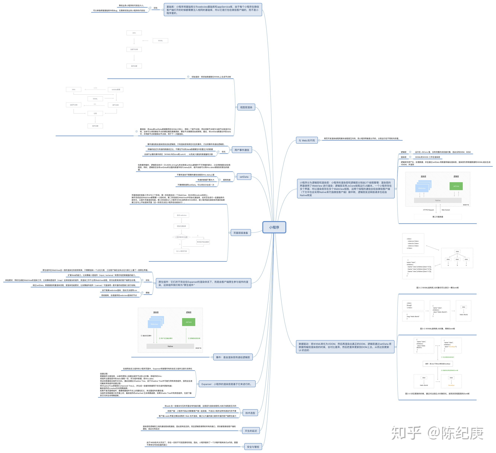

- [Vue 3.0](#vue-30)
  - [MVVM](#mvvm)
  - [vdom diff](#vdom-diff)
- [问题](#问题)
- [小程序](#小程序)

## Vue 3.0

1. 特性

   1. 更小
      - 全局 API，内置组件、功能 tree-shaking
      - 10kb gzipped
   2. 更快
      - 基于 proxy 的变动侦测，性能整体优于 getter/setter
      - Virtual DOM 重构:
        a). 编译模版的静态标记；b). 时间缓存；c). 静态提升
      - 编译器架构重构，更多的编译时优化
   3. 加强 API 设计一致性
   4. TypeScript 支持
   5. 采用 monorepo 结构，分层清晰

2. Composition API
   1. `reactive` 创建一个响应式对象，对应于 2.0 的`Vue.observable()`。
      ```
      setup() {
        const obj = reactive({count: 0, title: 'Vue 3.0'})
      }
      ```
   2. `ref`创建一个包装对象，ref 对象具有指向内部值的`.value`
      ```
      const count = ref(0)
      console.log(count.value) // 0
      ```
   3. `computed`计算属性
      `const computedCount = computed(() => count*100)`
   4. `watch`监听数据
      ```
      watch(() => obj.count, (count, prevCount) => {})
      ```
   5. lifeCycle
      | 原方法 | now |
      | --- | --- |
      | ~~beforeCreate~~ | setup |
      | ~~created~~ | setup|
      | beforeMount | onBeforeMount |
      | mounted | **onMounted** |
      | beforeUpdate | onBeforeUpdate |
      | updated | **onUpdated**|
      | beforeDestory | onBeforeUnmount |
      | destoryed | **onUnmounted** |

### MVVM

**目标**

- View 层的组件有一定处理输入并作出反馈的能力
- View 层的每一个组件应该来自 UI 库，UI 库的作者并不一定知道业务
- View 层的组装是由完全声明式的代码完成的，他可以由设计师通过工具直接生成的
- Model 层的编写是完全自由的，其中是普通的 JavaScript 对象，不能假设。

**架构**

View <---> ViewModel <---> Model

View --- 命令 ---> ViewModel
View <--双向绑定--> ViewModel

**原理**

Vue 双向绑定


1. 监听数据变化 - 观察者
   - 对 data 进行改造，对所有属性重写设置 get/set 方法，当获取属性或者设置属性时，添加对应逻辑
     - Object.defineProperty
     - Proxy
2. 管理订阅者 - Dep
   - 对订阅者进行存储、收集和通知
     ```
     class Dep {
        constructor() {
           this.subs = []
        }
        addSub(sub) {
           // 收集订阅者
           this.subs.push(sub)
        }
        notify() {
           // 通知所有的订阅者（Watcher），触发更新
           this.subs.forEach(sub => sub.update())
        }
     }
     ```
3. 订阅者 - Watcher
   - 每个订阅者都是对某条数据的订阅
   - 订阅者维护者每一次更新之前的数据，将其和更新之后的数据进行对比，如发生变化就执行相应业务逻辑，并更新订阅者中维护的数据的值。
   ```
   class Watcher {
      this.deps = []
      this.newDeps = []
      this.depIds = new Set()
      this.newDepIds = new Set()
   }
   ```
   

基于数据劫持的双向绑定原理：

1. 利用 Proxy 或 Object.defineProperty 生成的 Observer 对对象/属性进行劫持，在属性发生变化后通知订阅者
2. 解析器（Compile）解析模版中的 Directive 指令，收集指令依赖的方法和数据，等待数据变化然后渲染
3. Watcher 属于 Observer 和 Compile 之间的桥梁，它将接收到的 Oberser 产生的数据变化，并根据 Compile 提供的指令进行视图渲染，使得数据变化促使视图变化。

Object.defineProperty
缺陷：

1.  无法监听数组的变化
    1. 利用索引修改数组 `item[index] = newVal`
       - `Vue.set(example1.items, indexOfItem, newValue)`
    2. 修改数组的长度 `items.length = newLength`
       - `items.splice(newLength)`
    3. 监听数组需要遍历一遍数组挨个劫持，性能太差。其次 push 这种不改变原有索引的方法无法触发 setter，还需要再次遍历劫持。
2.  深度递归监听属性，一次性计算量大
3.  无法监听新增/删除属性

Proxy

1. 可以直接监听对象而非属性
   ```
   const newObj = new Proxy(obj, {
      get(target, key, receiver) {
         return Reflect.get(target, key, receiver)
      },
      set(target, key, val, receiver) {
         return Reflect.set(target, key, val, receiver)
      }
   })
   ```
2. Proxy 可以直接监听数组的变化

### vdom diff

`h() => vnode() => patch(patchVnode) diff => addVnodes removeVodes => updateChildren`

## 问题

1. 父子组件声明周期钩子

   1. 加载渲染过程 `父beforeCreate`->`父created`->`父beforeMount`->`子beforeCreate`->`子created`->`子beforeMount`->`子mounted`->`父mounted`
   2. 子组件更新过程 `父beforeUpdate`->`子beforeUpdate`->`子updated`->`父updated`
   3. 父组件更新过程 `父beforeUpdate`->`父updated`
   4. 销毁过程 `父beforeDestroy`->`子beforeDestroy`->`子destroyed`->`父destroyed`

2. 首页白屏
   原因：
   1. 首页资源需要下载（js，css）
   2. SPA 单页应用 DOM 是需要 js 执行生成的，js 执行需要时间。
      解决方案：
   3. 首页直出，节省 js 生成 dom 时间，直接渲染
   4. 减少静态资源包的大小
   5. 代码拆分，动态 import，prefetch
   6. 合理使用缓存，HTTP/2
   7. 常规操作：CDN，loading，骨架屏
3. nextTick
   Vue.js 在触发某个数据的 setter 之后，对应的 Watcher 订阅者对象会被 push 进一个队列 queue，在下一个 tick 的时候将这个队列的任务全部拿出来 run 执行一遍。
   vuejs 源码中在 microtask 上实现了一个 nextTick，在当前调用栈执行完之后才会去执行这个事件。
4. computed 🆚 watch
   1. computed 计算属性
      1. 计算属性本质上是`computed watcher`
         - computed watcher 并不会立刻求值，同时持有一个 dep 实例
      2. 计算属性适合用在模版渲染中，某个值是依赖了其他响应式对象甚至是计算属性计算而来
      3. computed 本身是通过代理的方式代理到组件实例上的，所以读取计算属性的时候，执行的是一个内部的 getter
      4. computed 内部实现了一个惰性的 watcher，在实例化的时候不会去求值，其内部通过 dirty 属性标记计算属性是否需要重新计算。当 computed 依赖的任意属性发生改变，都会通知这个惰性的 watcher，其 dirty 属性设置为 true，当再次读取这个属性的时候，就会去再次求值。
   2. watch 侦听属性
      1. 侦听属性本质上是`user watcher`
         - 在对 watcher 求值以及执行回调函数的时候，处理一下错误
      2. 侦听属性适合观察某个值的变化去完成一段复杂的业务逻辑。
5. v-if 🆚 v-show 🆚 v-html
   - v-if
     - v-if 会调用 addIfCondition，生成 vnode 的时候会忽略对应节点，render 的时候就不会渲染
     - Watcher 监听数据变化，然后生成 Vnode 节点，diff 算法对比新旧节点，patch 方法修改真正的 dom 元素
   - v-show
     - v-show 会生成 vnode 节点，render 的时候也会渲染成真实节点，但是在 render 的过程中会在节点的属性中修改 show 属性值，对应的是 display
   - v-html
     - 先移除节点下的所有节点，调用 html 方法，通过 addProp 添加 innerHTML 属性，对应于 innerHTML
6. 自定义 v-model - 自组件定义相同的 model 和 props
   ```
   // App.vue
   <p>{{name}}</p>
   <child-comp v-model="name">
   // ChildComp.vue
   <input type='text' :value="text" @input="$emit('change', $event.target.value)" />
   export default {
      model: {
         prop: 'text',
         event: 'change',
      },
      props: {
         text:{
            type: String,
            defaultValue() {
               return ''
            }
         }
      }
   }
   ```
7. 异步组件
   ```
   components: {
      componentA: () => import('./component/A')
   }
   ```
8. 动态组件 `<component :is="SOMECOMPONENT' />`
9. 缓存组件 `<keep-alive><comp /></keep-alive>`

## 小程序


